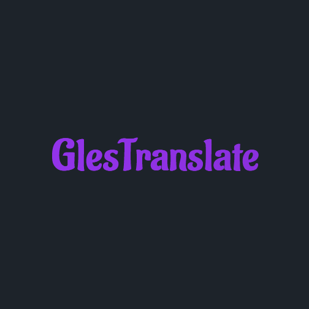

# GlesTranslate — 轻量 AI 翻译与识别（Web 版）

一个基于 `Vue 3 + Vite + Tailwind CSS + daisyUI` 的轻量网页端翻译与识别应用，支持：

- 文本翻译：内置翻译服务，或配置 OpenAI 兼容的自定义服务（支持流式输出）
- 图片文字识别（OCR）：上传图片或粘贴图片识别
- 音频转文字（ASR）：上传本地音频文件识别
- 语言管理：预设语言 + 自定义语言
- 翻译历史记录：侧边栏查看、回填与删除
- 数据备份与恢复：一键导出/导入 JSON

Android 端仓库链接：`https://github.com/Glassous/GlesTranslateAndroid`

---

## 功能特性

- 文本翻译
  - 默认服务：`https://api.jkyai.top/API/depsek3.1.php`（基于 `question/system` 参数）
  - 自定义 AI：OpenAI 兼容 `chat/completions` 流式接口（SSE），可配置 Base URL / API Key / Model
- 图片识别（OCR）
  - 默认服务：`https://api.pearktrue.cn/api/ocr/`（`multipart/form-data` 上传）
  - 自定义 AI：多模态模型（`image_url` Base64）流式返回识别内容
- 音频识别（ASR）
  - 默认服务：`https://api.pearktrue.cn/api/audiocr/`（`multipart/form-data` 上传）
  - 自定义 AI：多模态模型（`audio` Base64 + format）流式返回识别内容
- 语言管理
  - 预设语言（中文/英语/日语/韩语/法语/德语/西班牙语/俄语/阿拉伯语/葡萄牙语）
  - 自定义语言（输入名称后加入并记忆）
- 翻译历史记录
  - 自动记录最近 50 条，可回填源文本、选择语言、删除条目
- 数据持久化与备份
  - 使用 `localStorage` 持久化：历史、语言、选中语言、AI 配置、多模态开关
  - 备份/恢复：JSON 文件导出与导入
- 界面与体验
  - daisyUI 组件 + Tailwind CSS；Google Fonts（Aladin）
  - 支持暗色主题；平滑动画与响应式布局

## 界面预览



## 技术栈与架构

- 前端框架：`Vue 3`（`<script setup>`）
- 构建工具：`Vite`
- 样式：`Tailwind CSS` + `daisyUI`
- 数据存储：`localStorage`（无需后端）
- 流式接口：SSE 解析增量内容（`chat/completions`）

主要文件：
- `src/App.vue`：主界面与业务逻辑（翻译、OCR/ASR、历史、语言管理、AI 配置、备份恢复）
- `src/main.js`：应用入口
- `tailwind.config.js`、`postcss.config.js`：样式配置
- `vite.config.js`：构建配置

## 开发与运行

前置环境：推荐使用 `Node.js 20+`。

1) 安装依赖

```bash
npm i
```

2) 本地开发（热更新）

```bash
npm run dev
```

3) 构建生产包

```bash
npm run build
```

4) 预览构建产物

```bash
npm run preview
```

## Docker 运行

项目已提供 `Dockerfile`，默认在容器内执行 `npm run preview` 并暴露 `4173` 端口。

```bash
docker build -t glestranslate .
docker run --rm -p 4173:4173 glestranslate
```

浏览器访问：`http://localhost:4173/`

## 自定义 AI 配置（网页内）

在主界面左侧打开“AI配置”对话框：
- 勾选“启用自定义AI模型配置”
- 填写：`Base URL` / `Model` / `API Key`
- 若需要图片/音频识别，开启“全模态模型”，填写 `MultiModal Model`

请求说明：
- 文本翻译：`POST {baseUrl}/chat/completions`，携带 `messages`（system+user，启用 `stream: true`）
- OCR：`image_url` 使用 Base64；ASR：`audio` 使用 Base64 + `format`
- 响应解析：逐行处理 `data: {json}`，拼接 `delta.content`

## 内置服务与注意事项

- 翻译：`https://api.jkyai.top/API/depsek3.1.php`
- OCR：`https://api.pearktrue.cn/api/ocr/`
- ASR：`https://api.pearktrue.cn/api/audiocr/`

上述服务由第三方提供，可能存在速率、稳定性或地域限制；如需可靠性更高的体验，建议使用自定义 AI 服务并部署于可控环境。

## 数据备份与恢复

- 在“数据备份”对话框中：
  - 导出：生成包含历史、语言、自定义配置等的 JSON 文件
  - 导入：选择备份文件恢复数据（会覆盖当前配置）

## 目录结构

```
├── index.html
├── public/
│   └── GlesTranslate.png
├── src/
│   ├── App.vue
│   ├── main.js
│   └── style.css
├── tailwind.config.js
├── postcss.config.js
├── vite.config.js
├── Dockerfile
├── README.md
└── LICENSE
```

## 许可证

本项目使用 `Apache-2.0` 许可证。详见 `LICENSE` 文件。

## 致谢

- `Vue`、`Vite`、`Tailwind CSS`、`daisyUI`
- 开源与第三方服务生态的支持